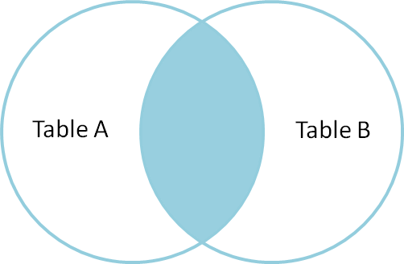
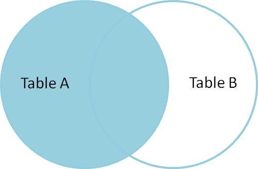

# Complex Queries Implementation

## JOINS

### 1. Inner Join

Selects all rows from both tables as long as the condition is satisfied.



Implementation example: *Write a query using an INNER JOIN to retrieve all bookings and the respective users who made those bookings*

```sql 

SELECT 	
	CONCAT(users.first_name, ' ', users.last_name) AS "Full Name",
	property.name AS "Hotel",
	booking.start_date AS "Arrival",
	booking.end_date AS "Departure",
	booking.status AS "Status"
FROM booking
INNER JOIN users ON booking.user_id = users.user_id
INNER JOIN property ON booking.property_id = property.property_id;

```

### 2. LEFT JOIN

Returns all rows from the left table, along with matching rows from the right table.



implemenation example: *Write a query using aLEFT JOIN to retrieve all properties and their reviews, including properties that have no reviews.*

```sql 
SELECT 
	property.name,
	review.rating,
	review.comment,
	review.created_at
FROM property
LEFT JOIN Review on property.property_id = review.property_id
ORDER BY review.rating;
```

### 3. Full Outer Join
Returns all the rows from all the tables, whether they match or not.

implementation example: *Write a query using a FULL OUTER JOIN to retrieve all users and all bookings, even if the user has no booking or a booking is not linked to a user.*

```sql 
SELECT
	CONCAT(users.first_name, ' ', users.last_name) AS "Full Name",
	property.name AS "Hotel",
	booking.start_date AS "Arrival",
	booking.end_date AS "Departure",
	booking.status AS "Status"
FROM users
FULL OUTER JOIN booking ON users.user_id = booking.user_id
FULL OUTER JOIN property ON property.property_id = booking.property_id;
```

## SUBQUERIES

- Simply a query nested within another query, allowing users to perform operations that depend on the results of *another query*.
-  A query *embedded* within another query.

The different types of subqueries are:
1. Single-Row Subquery: Returns a single row. Useful with comparison operators like =, > , <.
2. Multi-Row Subquery: Returns multiple values. Useful with operators IN, ANY, ALL.
3. Correlated Subquery: dependent on some columns from outer query to provide context.
-		Runs once per row.

4. Non-Correlated Subquery: Does not refer to the outer query and can be executed independently.

Examples:

*Write a query to find all properties where the average rating is greater than 4.0 using a subquery.*
```sql

-- Properties where average rating is >= 4.0
SELECT 
	p.name AS "Property Name",
	ROUND(AVG(r.rating), 2) as "Average Rating"
FROM property p
INNER JOIN review r on r.property_id = p.property_id
WHERE (SELECT AVG(r.rating) AS "Average Rating" FROM review r WHERE r.property_id = p.property_id) >=4
GROUP BY p.name
ORDER BY "Average Rating" DESC;

```

Example 2: 
*Write a correlated subquery to find users who have made more than 3 bookings.*

```sql
-- Users with more than 3 bookings
SELECT 
	u.first_name,
	COUNT(*)
FROM booking b
INNER JOIN users u ON u.user_id = b.user_id
WHERE (
	SELECT  COUNT(*) FROM  booking b
	WHERE b.user_id = u.user_id
) >= 4
GROUP BY u.first_name
ORDER BY count DESC;

```
