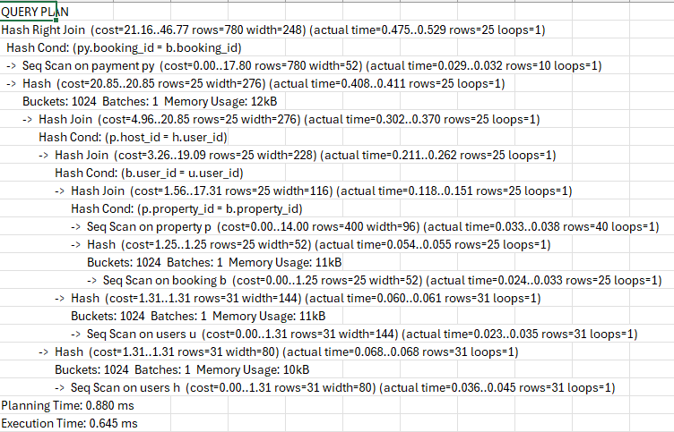

# Optimizing Complex Queries

The goal of this exercise is to refactor complex queries to improve performance. 

Below is the initial query that I wrote, to come up with all bookings along with the user_details, property details and payment details.

```sql
EXPLAIN ANALYZE SELECT 
	b.booking_id as "Booking ID",
	b.status as "Status",
	CONCAT(u.first_name, ' ', u.last_name) as "Full Name",
	u.phone_number as "Phone Number",
	u.email as "Email",
	p.name as "Property Name",
	p.location as "Location",
	CONCAT(h.first_name, ' ', h.last_name) as "Host Name",
	py.amount  AS "Payed Amount",
	py.payment_method AS "Payment Method"
FROM booking b
INNER JOIN users u ON u.user_id = b.user_id
INNER JOIN property p ON p.property_id = b.property_id
INNER JOIN users h ON h.user_id = p.host_id
LEFT JOIN payment py ON b.booking_id = py.booking_id;

```

The following is the performance analysis of the query, using the postgresql `EXPLAIN` feature.


I then added the following lines to added the following lines to optimize the query and re-run the initial query.

```sql
CREATE INDEX IF NOT EXISTS idx_booking_user_id ON booking(user_id);
CREATE INDEX IF NOT EXISTS idx_booking_property_id ON booking(property_id);
CREATE INDEX IF NOT EXISTS idx_property_host_id ON property(host_id);
CREATE INDEX IF NOT EXISTS idx_payment_bookin_id ON payment(booking_id);
CREATE INDEX IF NOT EXISTS idx_users_user_id ON users(user_id);
CREATE INDEX IF NOT EXISTS idx_property_property_id ON property(property_id);
CREATE INDEX IF NOT EXISTS idx_booking_booking_id ON booking(booking_id);
CREATE INDEX IF NOT EXISTS idx_payment_payment_id ON payment(payment_id);

```

This is the Explain summary after optimization:


## Explanation of the changes


| Metric             | Original          | Optimized         | Change      | Explanation                                                                 |
| ------------------ | ----------------- | ----------------- | ----------- | --------------------------------------------------------------------------- |
| **Planning Time**  | 0.880 ms          | 8.605 ms          | 🔼 +878%    | Added join complexity (extra user join for host) increases planning effort. |
| **Execution Time** | 0.645 ms          | 0.927 ms          | 🔼 +44%     | Slight overhead from deeper join chain and hash calculations.               |
| **Output Rows**    | 25                | 25                | ➖ No change | Logic remains consistent—just expanded to include host details.             |
| **Join Strategy**  | Nested Hash Joins | Nested Hash Joins | ➖ No change | Efficient for small datasets; good use of hash joins maintained.            |

---

**Conclusion**:
The optimized query slightly increases planning and execution time due to an extra join, but it correctly retrieves host details and maintains excellent performance overall.


