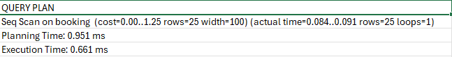
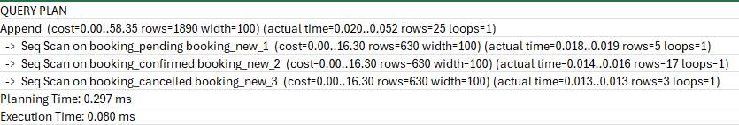

# Partitioning

[Click here to access the sql script](partitioning.sql)

For this exercise, I used the `booking` table, which holds the records for all bookings made in the system. 

I ran an initial sql command to list all the records in the bookings table as shown  below:

```sql

EXPLAIN ANALYZE SELECT * FROM booking;

```

The output is as shown in the image below:




I than ran the query below to create a new table `booking_new`, partitioned by the `status` field.

```sql
CREATE TYPE IF NOT EXISTS booking_status AS ENUM('confirmed', 'pending', 'cancelled');

CREATE TABLE IF NOT EXISTS booking_new(
	booking_id UUID NOT NULL DEFAULT uuid_generate_v4(),
	property_id UUID NOT NULL,
	user_id UUID NOT NULL,
	start_date DATE NOT NULL,
	end_date DATE NOT NULL,
	total_price DECIMAL NOT NULL,
	status booking_status NOT NULL,
	created_at TIMESTAMP DEFAULT CURRENT_TIMESTAMP,

	PRIMARY KEY(booking_id, status),
	FOREIGN KEY (property_id) REFERENCES property(property_id),
	FOREIGN KEY (user_id) REFERENCES users(user_id)
) PARTITION BY LIST (status);

-- CREATE A TABLE FOR EACH STATUS
CREATE TABLE booking_confirmed PARTITION OF booking_new
FOR VALUES IN ('confirmed');
CREATE TABLE booking_pending PARTITION OF booking_new
FOR VALUES IN ('pending');
CREATE TABLE booking_cancelled PARTITION OF booking_new
FOR VALUES IN ('cancelled');

-- Insert values from the booking table
INSERT INTO booking_new
SELECT * FROM booking;

EXPLAIN ANALYZE SELECT * FROM booking_new;

```

Below is the output:



## Observations and conclusion

| Metric              | Before Partition | After Partition | % Change  | Explanation (Comment)                                            |
| ------------------- | ---------------- | --------------- | --------- | ---------------------------------------------------------------- |
| Cost Estimate       | 1.25             | 58.35           | +4568% ⬆️ | Cost estimate increased due to scanning multiple partitions.     |
| Rows Estimated      | 25               | 1890            | +7460% ⬆️ | More rows considered overall because of combined partitions.     |
| Actual Time (ms)    | 0.091            | 0.052           | -42.9% ⬇️ | Real execution faster due to targeted partition scans.           |
| Execution Time (ms) | 0.661            | 0.080           | -87.9% ⬇️ | Query runs way faster after partitioning, less IO per partition. |
| Planning Time (ms)  | 0.951            | 0.297           | -68.8% ⬇️ | Planning simpler because partitions narrow the search.           |
